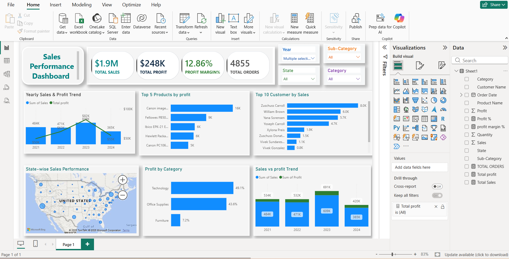

# Sales Performance Dashboard – Power BI

## About the Project

I created this Power BI dashboard to analyze sales and profit data and understand which products, customers, categories, and states are performing better.

The dashboard contains different visuals and filters so the data can be explored easily.

## Tools Used

* Power BI
* Power Query
* DAX

## Dashboard Includes

* Total Sales
* Total Profit
* Profit Margin %
* Total Orders
* Yearly Sales & Profit Trend
* Top 5 Products by Profit
* Top 10 Customers by Sales
* State-wise Sales Performance
* Profit by Category
* Sales vs Profit Trend

## Filters

The dashboard can be filtered using:

* Year
* State
* Category
* Sub-Category

## What I Worked On

* Cleaned and prepared the data in Power Query.
* Created DAX measures for the required KPIs.
* Created relationships and used the data for different visualizations.
* Built an interactive dashboard using charts, KPI cards, slicers, and a map.
* Used the dashboard to compare sales and profit across different areas of the data.

## Dashboard
 
 
 
The Power BI `.pbix` file is available in this repository.

